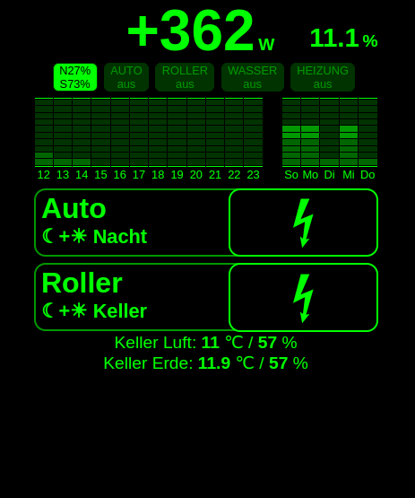

# Solarstrom-Eigenverbrauch-Optimierung

Steuerung, um den Solarstrom-Eigenverbrauch zu optimieren und die Solar-Batterie dabei
weitgehend schonend zu behandeln.

Konkret:
- Pufferbatterie beim Laden anderer Verbraucher am besten nur, wenn überhaupt, zwischen 40% und 60% zu "bewegen"
- Pufferbatterie-Zielladestand am Ende des Tages: 80%
- Bei drohender Einspeisung: frühzeitiges Überladen der Warmwasser- und Heizungsanlage

## Steuerungs-UI



- Obere Zeile:
  - Links: Überschuss-Leistung (Solarerzeugung abzüglich Hausverbrauch)
  - Rechts: Pufferakku-Ladestand
- Zweite Zeile (v.l.n.r; schwarz=aktiv, grau=inaktiv):
  - Status Solarerzeugung incl relative Verteilung der Leistung der beiden Dachhälften
  - Ladestatus von Auto-Wallbox, Roller-Lader, Warmwasser-Überladen, Heizungs-Überladen und "Verbrennen" (&Delta;)
    - Verbrennen = extra Schalt-Dose, die nur bei akkutem Pufferakku-Überlauf aktiviert wird.
- Dritte Zeile:
  - Links: Vorhersage des Pufferakku-Ladestandes der nächsten 12 Stunden
  - Rechts: Vorhersage der Sonnenenergie der nächsten 5 Tage
  - schwarze Balken bedeuten in beiden Fällen, das potentiell zu viel Energie vorhanden sein wird (passt nicht mehr in Pufferakku = Netzeinspeisung)
  - Die Balken sind via Fibonacci-Folge gestaffelt. Helle Balken, ganz unten, stellen bis 20% Akkustand dar, die etwas dunkleren bis 100%.
- Unterer Bereich: Schalter der Ladesteuerung
  - 5x (langsames) tippen auf "Roller" schaltet die Ladeleistung um
    - die zweite, externe Ladedose wird aktiviert und diese wird genutzt (beide Akkus im Roller mit einem Lader)
    - die "normale" dient dann nur als Fallback 
  - Klick auf Button &#9889; (Blitz) = Egal was ist kommt, es wird geladen
    - Ist der Button schwarz, ist erzwungenes Laden aktiv bis kein Strom mehr abgenommen wird. Dann schaltet er automatisch zurück auf Überschussladen.
    - Ansonsten ist Überschussladen aktiv und der Pufferakku-Zielwert von 80% bis zum Sonnenuntergang wird angestrebt

## Systembestandteile:
- ein ESP8266-E12 als Zentrale
  - Dem wurde eine SD-Karte als Datenspeicher hinzugefügt 
    - 
    - Quelle: <https://www.mischianti.org/2019/12/15/how-to-use-sd-card-with-esp8266-and-arduino/#esp8266>
- 3x "3V Relais Power Switch Board"
  - Werden verwendet, um die potentialfreihen Eingänge der Wärmepumpen und der Wallbox zu schalten
  - Da die ESPs nur sehr wenig Leistung abgeben können, wird jedes Relais von einem weiteren ESP8266-E12 betrieben. Die Steuerung erfolgt via Netzwerk.
- 2x "Shelly Plug S"
  - Wird genutzt, um den Roller-Lader zu schalten (1x innen und 1x aussen)
  - wird per WLAN gesteuert
- "Shelly Plug" 3,5kW
  - Wird genutzt, um Überschuss irgendwie zu nutzen (z.B. für eine Elektro-Heizung)
  - wird per WLAN gesteuert
- Ein "Shelly Button"
  - aktiviert das Forcierte Laden des Autos (macht die UI obsolet; kann im Auto bleiben)
- Ein (ausgedienter) KindlePaperwhite der ersten Generation als Anzeige
  - Der genutzte Beta-Browser hat einige Eigenheiten, wewegen die UI auf anderen Geräte schräg aussieht
  - Auf dem Kindle wurde der Bildschirm dauerhaft eingeschaltet via "~ds" im Suchfeld eingeben
    - Quelle: <https://ebooks.stackexchange.com/questions/152/what-commands-can-be-given-in-the-kindles>
- Ein kostenloser Dev-Zugang zum Dienst AccuWeather.com, um Vorhersagen zu Solareinstrahlung zu erhalten
  - 50 Requests pro Tag sind erlaubt, das System benutzt 24 (Stündliche Vorhersage) + 4 (Tages-Vorhersage)
  - Die LocationID muss dazu ermitteln werden via <https://developer.accuweather.com/accuweather-locations-api/apis/get/locations/v1/search>
- Wechselrichter "Fronius Symo Gen 24 8.0 Plus" an 8,25 kWp monokristallinen Solarpanelen
- 7,65 kWh LiFePo4 Solarbatterie "BYD Battery-Box HVS 7,7" 
- Leistungsmessung via "Fronius Smart Meter"
- E-Auto an Wallbox "Süwag eBox AC11-SÜW"
  - via potentialfeiem Eingang sperrbar 
  - aka "Süwag eBox plus"
  - fast Baugleich zu "Vestel EVC04-AC11"
- Warmwasser-Wärmepumpe "Viessmann Vitocal 060-A, Typ TOS-ze Umluft 254L"
  - via potentialfeiem Eingang kann es "überladen" werden (Zieltemperatur wird temporär auf Maximum gesetzt)
  - [PV-Anschluss Doku](https://www.viessmann-community.com/t5/Waermepumpe-Hybridsysteme/Funktion-PV-Anlage-mit-Vitocal-262-A-und-Vitocal-060-A/m-p/303739/emcs_t/S2h8ZW1haWx8dG9waWNfc3Vic2NyaXB0aW9ufExENDlMU0w2VVlVREtCfDMwMzczOXxTVUJTQ1JJUFRJT05TfGhL#M64397)
Kommt noch:
- Warmwasser-Wärmepumpe "Viessmann Vitocal 060-A, Typ TOE-ze Umluft 178L" als Heizung
  - Steuerung baugleich wie Warmwasser
- Heizungs-Mischer - noch unbekannt

## Einrichtung
- Die Zentrale mit der SD-Karte versehen
- Die Netz-Relay-ESPs mit den Relays verbinden und an die passenden, potentialfreien Eingänge hängen
- Die Shelly-Plug im Netzwerk einrichten
- [ArduinoIDE](https://www.arduino.cc/en/software) installieren
  - Dort den [Boardmanager](http://arduino.esp8266.com/stable/package_esp8266com_index.json) einfügen (siehe [Anleitung](https://circuitjournal.com/esp8266-with-arduino-ide))
  - in der Bibliotheksverwaltung die Module "SD", "Regexp" und "Time" installieren
- Die IPs der ESPs im Netzwerk einrichten, dass diese immer auf die gleiche Art erreichbar sind
- unter /netz-relay und /zentrale jeweils die _TEMPLATE.config.h in config.h kopieren und dort sinnvolle Werte eintragen
  - nach 14 Tagen laufzeit kann man mit diesen Scripten ermitteln lassen, wie der "grundverbrauch_in_w_pro_h". Werte für "solarstrahlungs_vorhersage_umrechnungsfaktor" wird nach ca. einem Monat irgend etwas stabiles ergeben.
    ```
    cd /script/
    perl download_der_daten_der_zentrale.pl [IP-DER-ZENTRALE]
    perl ermittle_statistik.pl [IP-DER-ZENTRALE]
    ```
- In der IDE das Script netz-relay/netz-relay.ino öffnen und auf die Netz-Relay-ESPs spielen
- In der IDE das Script zentrale/zentrale.ino öffnen und auf das zentrale Steuer-ESP spielen
- Option1: Auf z.B. dem KindlePaperwhite die UI der Zentrale aufrufen http://[IP-DER-ZENTRALE]/
  - Das forcierte Laden von Rollerund Autokann über den dortigen Button gesteuert werden
- Option2: mit z.B. einem ShellyButton die URL der Zentrale aufrufen, um das Laden zu forcieren (erzwungenes Volladen, egal was die Daten sagen)
  - forciertes Laden des Autos: http://[IP-DER-ZENTRALE]/change?key=auto&value=force
    - wieder zurücksetzen: http://[IP-DER-ZENTRALE]/change?key=auto&value=solar
  - forciertes Laden des Rollers: http://[IP-DER-ZENTRALE]/change?key=roller&value=force
    - wieder zurücksetzen: http://[IP-DER-ZENTRALE]/change?key=roller&value=solar

## HINWEIS
Wechselrichter und Batterie sollten nie im Netzwerk mit anderen Endgeräten sein. Die Zugänge
sind fest codiert und "zertifizierten Handwerkern" bekannt. Also jedem. Jemand/Etwas auf einem
anderen Endgerät im gleichen Netzwerk könnte also problemlos Schaden anrichten. Und: SSL kennen
die Geräte nicht.

# TODO Anstehende Aufgaben
- persistence-Objekt benutzen, um die Daten im RAM und nicht auf der SD zu halten (um SD zu schonen)
-- Das enthält Write/Read und hat selber extra Funktionen, um die Daten im RAM zu halten (als Char*)
-- Will man explizit schreiben/lesen von FS, muss das im Code auch explizit sein
-- RAM ist dann Default, SD der Fallback, wenn bei neustart der RAM leer ist
-- Schreiben der SD alle x Minuten sicherstellen
- Grundverbrauch und Solarstrahlungs-Umrechnung via SD-Config verwalten, damit man die Werte von außen vorgeben kann
-- Solarstrahlungs-Umrechnung umstellen, dass jeden Monat ein anderer Wert genutzt werden kann. Die Werte Schwanken über das Jahr.
-- Grundverbrauch in Tag und Nacht trennen (und Ladevorgänge herausrechnen) um bessere Vorhersagen zu haben
- Akku-Haltbarkeit: Laden zwischen 20-80% ist weniger schlimm, 40-60 am wenigsten. Diese Bereiche zusätzlich mit angeben (x% 20-80%, x% 40-60%) 
- Button für "Pufferakku leeren": Wenn früh Morgens klar ist, dass alles überläuft und das Auto noch Platz hat, dann alles ins Auto pumpen bevor man weg fährt
- E-Laden: Nicht als Funktion, sondern automatisch!
-- Lädt früh Auto+Roller ab 6 Uhr, wenn der Akku Tagsüber überläuft und noch > 25% drin sind, bis 20% runter
